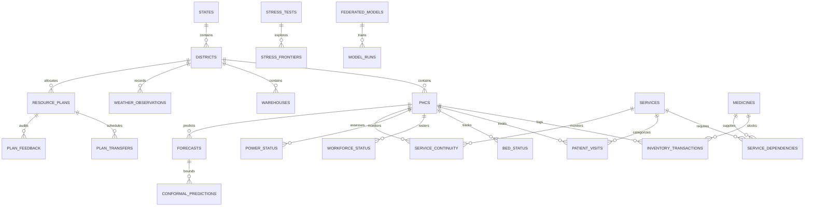

# HippoGrid Database Schema Specification

**Project**: HIPPOGRID (Healthcare Infrastructure & Primary-care Planning Optimization Grid)  
**Database**: Supabase PostgreSQL (System of Record)  
**ORM**: SQLAlchemy 2.0  
**Migration Path**: `supabase/migrations/`

---

## 1. Architectural Principles

1. **System of Record**: Supabase PostgreSQL is the sole persistent store for all master data, operational telemetry, digital twin state forecasts, optimization interventions, and governance audits.
2. **Keying Strategy**:
   - UUIDv4 primary keys for operational, telemetry, and transactional entities (`phcs`, `districts`, `inventory_transactions`, etc.).
   - Standard semantic string IDs for domain-constant master codes (`services`, `medicines`, `states`).
3. **Data Integrity & Constraints**:
   - Foreign keys with `ON DELETE CASCADE` across topological parent-child relationships.
   - Non-negativity check constraints (`stock_after >= 0`, `total_beds >= 0`, `visit_count >= 0`) preventing invalid physical states.
4. **Security & Access Isolation**:
   - Raw database connection strings (`DATABASE_URL`) are strictly restricted to the FastAPI backend service.
   - Frontend accesses data exclusively via authenticated FastAPI endpoints or secure Supabase Edge views.

---

## 2. Entity Relationship Overview

---

## 3. Relational Table Specifications

### A. Master & Topological Tables

#### 1. `states`
- **Purpose**: Top-level geopolitical administrative boundary.
- **Primary Key**: `id` (UUID)
- **Unique Columns**: `code` (VARCHAR(10)) — e.g. `STA`, `STB`, `STC`
- **Columns**: `name`, `created_at`

#### 2. `districts`
- **Purpose**: Sub-state operational planning zone.
- **Primary Key**: `id` (UUID)
- **Foreign Key**: `state_id` $\rightarrow$ `states(id)` (ON DELETE CASCADE)
- **Unique Columns**: `code` (VARCHAR(20)) — e.g. `DST-A1`
- **Columns**: `name`, `headquarters`, `created_at`
- **Indexes**: `idx_districts_state_id`

#### 3. `phcs`
- **Purpose**: Primary Health Centre facility profile, catchment metrics, and hardware specs.
- **Primary Key**: `id` (UUID)
- **Foreign Key**: `district_id` $\rightarrow$ `districts(id)` (ON DELETE CASCADE)
- **Unique Columns**: `code` (VARCHAR(30)) — e.g. `PHC-DST-A1-01`
- **Columns**: `name`, `facility_type`, `latitude`, `longitude`, `catchment_population`, `remote_flag`, `vulnerability_score`, `total_beds`, `staff_mo`, `staff_nurse`, `staff_anm`, `backup_power_type`, `backup_power_capacity_kva`, `backup_power_hours`, `solar_capacity_kw`, `active`, `created_at`
- **Indexes**: `idx_phcs_district_id`

#### 4. `warehouses`
- **Purpose**: Central pharmaceutical and resource distribution hub for district logistics.
- **Primary Key**: `id` (UUID)
- **Foreign Key**: `district_id` $\rightarrow$ `districts(id)` (ON DELETE CASCADE)
- **Unique Columns**: `code` (VARCHAR(30)) — e.g. `WH-DST-A1`
- **Columns**: `name`, `latitude`, `longitude`, `cold_chain_capacity_liters`, `dry_storage_capacity_sqm`, `created_at`
- **Indexes**: `idx_warehouses_district_id`

#### 5. `services`
- **Purpose**: Catalog of essential primary care clinical service lines.
- **Primary Key**: `id` (VARCHAR(50)) — e.g. `diarrhoeal_care`, `maternal_delivery`, `vaccination`, `fever_malaria`
- **Columns**: `name`, `category`, `criticality` (`CRITICAL`, `HIGH`, `STANDARD`), `min_staff_required`, `requires_uninterrupted_power`, `created_at`

#### 6. `service_dependencies`
- **Purpose**: Multi-dependency mapping required to maintain clinical continuity.
- **Primary Key**: `id` (UUID)
- **Foreign Key**: `service_id` $\rightarrow$ `services(id)` (ON DELETE CASCADE)
- **Columns**: `dependency_type` (`POWER`, `COLD_CHAIN`, `STAFF`, `MEDICINE`, `OXYGEN`), `dependency_identifier`, `is_mandatory`, `threshold_min_hours`, `created_at`, `updated_at`
- **Indexes**: `idx_service_deps_service_id`

#### 7. `medicines`
- **Purpose**: Essential pharmaceuticals and cold chain consumables.
- **Primary Key**: `id` (VARCHAR(50)) — e.g. `ORS`, `IV_fluids`, `zinc`, `oxytocin`, `paracetamol`, `ACT_antimalarial`, `vaccine_penta`, `amlodipine`
- **Columns**: `name`, `category`, `unit`, `is_cold_chain_required`, `min_temp_celsius`, `max_temp_celsius`, `created_at`

---

### B. Operational Observability & Sensor Telemetry

#### 8. `inventory_transactions`
- **Purpose**: Ledger of pharmaceutical receipts, clinical consumption, transfers, and expirations.
- **Primary Key**: `id` (UUID)
- **Foreign Keys**: 
  - `phc_id` $\rightarrow$ `phcs(id)`
  - `medicine_id` $\rightarrow$ `medicines(id)`
- **Constraint**: `CHECK (stock_after >= 0)` (Enforces zero negative inventory)
- **Columns**: `quantity_change`, `stock_after`, `transaction_type`, `recorded_at`, `created_at`
- **Indexes**: `idx_inv_tx_phc_id`, `idx_inv_tx_med_id`, `idx_inv_tx_rec_at`

#### 9. `patient_visits`
- **Purpose**: Daily clinical presentations per service line.
- **Primary Key**: `id` (UUID)
- **Foreign Keys**: `phc_id` $\rightarrow$ `phcs(id)`, `service_id` $\rightarrow$ `services(id)`
- **Constraint**: `CHECK (visit_count >= 0)`
- **Columns**: `visit_count`, `recorded_at`, `created_at`
- **Indexes**: `idx_patient_visits_phc_id`, `idx_patient_visits_svc_id`, `idx_patient_visits_rec_at`

#### 10. `bed_status`
- **Purpose**: Facility inpatient bed utilization.
- **Primary Key**: `id` (UUID)
- **Foreign Key**: `phc_id` $\rightarrow$ `phcs(id)`
- **Columns**: `total_beds`, `occupied_beds`, `critical_care_beds`, `recorded_at`, `created_at`
- **Indexes**: `idx_bed_status_phc_id`

#### 11. `workforce_status`
- **Purpose**: Daily roster of clinical staff physically on duty.
- **Primary Key**: `id` (UUID)
- **Foreign Key**: `phc_id` $\rightarrow$ `phcs(id)`
- **Columns**: `medical_officers_on_duty`, `staff_nurses_on_duty`, `anm_on_duty`, `recorded_at`, `created_at`
- **Indexes**: `idx_workforce_phc_id`

#### 12. `power_status`
- **Purpose**: Electrical grid uptime, battery storage, and diesel fuel telemetry.
- **Primary Key**: `id` (UUID)
- **Foreign Key**: `phc_id` $\rightarrow$ `phcs(id)`
- **Columns**: `grid_available`, `outage_hours`, `generator_fuel_liters`, `battery_charge_percent`, `cold_chain_temp_celsius`, `recorded_at`, `created_at`
- **Indexes**: `idx_power_status_phc_id`

#### 13. `weather_observations`
- **Purpose**: District meteorological conditions and environmental disaster risks.
- **Primary Key**: `id` (UUID)
- **Foreign Key**: `district_id` $\rightarrow$ `districts(id)`
- **Columns**: `temperature_celsius`, `rainfall_mm_per_hour`, `flood_risk_level`, `recorded_at`, `created_at`
- **Indexes**: `idx_weather_district_id`

#### 14. `road_status`
- **Purpose**: Topological edge transit duration and flood impassability.
- **Primary Key**: `id` (UUID)
- **Foreign Keys**: `origin_phc_id` $\rightarrow$ `phcs(id)`, `destination_phc_id` $\rightarrow$ `phcs(id)`
- **Columns**: `distance_km`, `transit_duration_minutes`, `passability_status` (`PASSABLE`, `DEGRADED`, `BLOCKED`), `recorded_at`, `created_at`
- **Indexes**: `idx_road_status_origin`, `idx_road_status_dest`

---

### C. Digital Twin Forecasts, Optimization & Governance

#### 15. `forecasts` & 16. `conformal_predictions`
- **Purpose**: Predictive lead times to resource exhaustion with conformal prediction uncertainty bands (e.g. 95% coverage).

#### 17. `service_continuity`
- **Purpose**: Core real-time continuity health per facility-service pair answering:
  1. *Which service is at risk?*
  2. *At which PHC?*
  3. *How many hours until compromise?*
  4. *Which dependency is the bottleneck?*
- **Indexes**: `idx_continuity_phc_id`, `idx_continuity_svc_id`, `idx_continuity_status`, `idx_continuity_assessed`

#### 18. `resource_plans`, 19. `plan_transfers`, 20. `plan_feedback`
- **Purpose**: Prescriptive interventions generated by OR-Tools and human decision-maker approvals.

#### 21. `stress_tests` & 22. `stress_frontiers`
- **Purpose**: Combinatorial shock survivability limits across compound flood and power outages.

#### 23. `federated_models` & 24. `model_runs`
- **Purpose**: Multi-district privacy-preserving model coordination.

#### 25. `audit_logs`
- **Purpose**: Immutable security audit trail of administrative modifications and overrides.

---

## 4. Dashboard Query Optimization Strategy & Views

To achieve sub-50ms dashboard responsiveness without N+1 query bottlenecks, three analytical views are provided:

### 1. `v_phc_continuity_summary`
- **Strategy**: Single-trip denormalization joining facility geography (`phcs`, `districts`, `states`) with lateral joins for the lowest `hours_to_compromise` service continuity and latest `power_status`.
- **Usage**: Primary map and facility table queries.

### 2. `v_service_risk_monitor`
- **Strategy**: Aggregated cross-join calculating network-wide continuity percentage and counts of facilities at risk for each clinical service.
- **Usage**: Top-level KPI cards and service line health bars.

### 3. `v_daily_operational_snapshot`
- **Strategy**: Latest daily telemetry roll-up of bed occupancy, workforce on duty, and power outages.
- **Usage**: District health officer operational dashboard.
