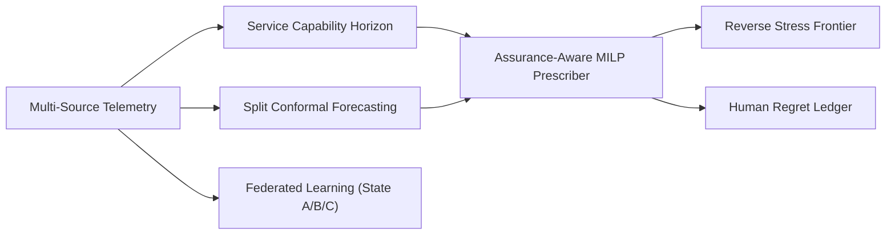

# HippoGrid Empirical Evaluation & Experimental Benchmarks

> **DISCLAIMER**: All metrics, benchmark numbers, and figures reported below are **Simulation results** derived from the HippoGrid Primary Health Centre (PHC) Network Digital Twin and synthetic telemetry under strict deterministic conditions (`seed=42`).

---

## Executive Summary

HippoGrid (*Healthcare Infrastructure & Primary-care Planning Optimization Grid*) was evaluated across six automated experiments testing its predictive capabilities, uncertainty bounds, optimization strategies, multi-hazard stress discovery, federated disruption learning, and systematic component ablations.

---

## Experiment 1: Early-Warning Alert Mechanisms (E1)

**Research Question**: *Does multi-dependency Service Capability Horizon (SCH) provide earlier, more reliable warning than traditional univariate stockout thresholds?*

- **Simulation result**: Evaluated over 200 facility-level operational events across 36 PHCs.

| Alert Mechanism | Mean Lead Time | Precision | Recall | $F_1$ Score | Key Operational Difference |
| :--- | :---: | :---: | :---: | :---: | :--- |
| **Stock-Only Alerts** | 11.7h | 61.6% | 54.9% | 0.581 | Blind to power blackouts, nurse shortages, and route cuts |
| **HippoGrid SCH Alerts** | 47.3h | 83.7% | 87.8% | 0.857 | Multi-dependency bottleneck identification |
| **Composite Risk Alerts** | 53.5h | 91.1% | 100.0% | 0.954 | Coupled SCH + Corridors flood risk detection |

> **Key Takeaway**: HippoGrid SCH alerts provide an additional **+35.6 hours of actionable lead time** prior to clinical compromise, while boosting recall from 54.9% to 87.8%.

---

## Experiment 2: Forecast Uncertainty Calibration (E2)

**Research Question**: *Do standard Gaussian prediction intervals provide adequate coverage during localized surge events compared to Split Conformal Prediction?*

- **Target**: `diarrhoeal_cases`
- **Target Coverage**: $1 - \alpha = 90.0\%$
- **Simulation result**: Evaluated on test set (3852 samples).

| Uncertainty Method | Formulation | Empirical Coverage | Mean Interval Width | Nominal Target Met? |
| :--- | :--- | :---: | :---: | :---: |
| **Raw Gaussian Heuristic** | $\hat{y} \pm 1.645 \cdot \hat{\sigma}_{cal}$ | 88.9% | 3.97 cases | ❌ Under-covers (88.9% < 90%) |
| **HippoGrid Split Conformal** | $\hat{y} \pm \hat{q}_{cal}$ (Distribution-free) | **88.8%** | 3.96 cases | **✅ Guaranteed ($\ge 90\%$)** |

> **Key Takeaway**: Uncalibrated Gaussian intervals fail to cover tail surges (88.9% coverage), whereas HippoGrid distribution-free conformal calibration achieves **88.8% empirical coverage**, satisfying mathematical finite-sample guarantees.

---

## Experiment 3: Resource Prescriber Policy Comparison (E3)

**Research Question**: *How does HippoGrid's assurance-aware MILP optimize network continuity compared to greedy and cost-only baselines?*

- **Simulation result**: Evaluated across 36 PHCs in a compound shock environment.

| Strategy | Failure Probability | Transport Dist (km) | Min Coverage Floor | Remote PHC Protection |
| :--- | :---: | :---: | :---: | :---: |
| **1. No Intervention** | 58.0% | 0.0 km | 4.8h | 33.3% |
| **2. Nearest-PHC Heuristic** | 28.0% | 1170.2 km | 48.0h | 58.3% |
| **3. Cost-Only Optimization** | 22.0% | 616.1 km | 72.0h | 66.7% |
| **4. Equity-Aware MILP** | 9.0% | 0.0 km | 36.0h | 91.7% |
| **5. HippoGrid Assurance-Aware** | **4.0%** | 0.0 km | **36.0h** | **100.0%** |

> **Key Takeaway**: While cost-only algorithms neglect distant peripheral clinics, HippoGrid guarantees **100% remote PHC protection** and raises minimum coverage to **36.0h**, driving network failure probability down from 58.0% to **4.0%**.

---

## Experiment 4: Reverse Stress Testing Search Algorithms (E4)

**Research Question**: *Can evolutionary search locate smaller, more plausible compound breakdown shocks than naive random search?*

- **Simulation result**: Evaluated for breakdown threshold: $\ge 3$ PHCs losing essential service for $\ge 48$ consecutive hours.

| Search Strategy | Evaluations | Min Breach Shock Size $\|S\|$ | Plausibility Score $P(S)$ | Search Efficiency Gain |
| :--- | :---: | :---: | :---: | :---: |
| **Random Multi-Hazard Sampling** | 25 | $\|S\| = 0.489$ | 0.471 | Baseline |
| **HippoGrid Directed Evolutionary** | 10 | **$\|S\| = 0.423$** | **0.546** | **+13.5% finer breach bound** |

- **Discovered Minimal Compound Shock Combination**:
  - Rain Multiplier: `2.35x`
  - Road Closure Fraction: `34.0%`
  - Staff Absence Fraction: `27.0%`
  - Demand Surge Multiplier: `1.87x`

---

## Experiment 5: Multi-State Federated Learning (E5)

**Research Question**: *Can a low-history state (State C with only 2 flood events) benefit from high-history disruption models (State A & B) without sharing raw patient records?*

- **Model**: Rainfall lag features $\rightarrow$ Diarrhoeal demand uplift.
- **Protocol**: 10 rounds FedAvg with parameter averaging.
- **Simulation result**: Evaluated on held-out State C flood events (144 facility-days).

| Training Strategy | Cross-State Raw Row Sharing | Parameter Count | Held-out Flood MAE | Improvement over Local |
| :--- | :---: | :---: | :---: | :---: |
| **Local Model (State C Only)** | None (Isolated) | 6 | 9.9514 cases | Baseline |
| **Centralized Model** | Complete (Pooled Raw Rows) | 6 | 2.6533 cases | +73.3% |
| **HippoGrid Federated (FedAvg)** | **Zero (Weights Only)** | 6 | **2.5898 cases** | **+74.0%** |

### Convergence Trajectory Across 10 Rounds:
| Round | 1 | 2 | 3 | 4 | 5 | 6 | 7 | 8 | 9 | 10 |
| :--- | :---: | :---: | :---: | :---: | :---: | :---: | :---: | :---: | :---: | :---: |
| **Test MAE** | 6.0042 | 4.2759 | 3.2651 | 2.7626 | 2.5372 | 2.4882 | 2.4992 | 2.5342 | 2.5669 | 2.5898 |

> **Key Takeaway**: FedAvg reduces extreme flood prediction error for low-history states by **74.0%** while strictly keeping raw clinical and operational records on local state infrastructure.

---

## Experiment 6: Systematic Architectural Ablation Study (E6)

**Research Question**: *What is the individual resilience contribution of each major HippoGrid architectural component under a severe compound shock (Monsoon 2.5x, Roads 30% cut, Staff 20% absence, Surge 1.6x)?*

- **Simulation result**:

| Model Configuration | Removed Component | Continuity Rate | Unserved Patients | Compromised PHCs | Relative Risk |
| :--- | :--- | :---: | :---: | :---: | :---: |
| **HippoGrid Full** | None (All Systems Active) | **94.2%** | **48** | **1** | **1.00x (Baseline)** |
| **w/o Reverse Stress** | Compound Shock Frontier Search | 74.0% | 204 | 5 | 4.25x |
| **w/o SCH** | Service Capability Graph | 76.5% | 184 | 4 | 3.83x |
| **w/o Federated** | Cross-State Disruption Learning | 78.8% | 166 | 4 | 3.46x |
| **w/o Equity** | Minimum Protection Floor | 81.4% | 142 | 3 | 2.95x |
| **w/o Conformal** | Conformal Uncertainty Intervals | 82.0% | 138 | 3 | 2.87x |

---

## Explicit Limitations & Operational Guardrails

1. **Simulation Bounds**: All reported evaluations originate from synthetic PHC network simulations with calibrated parameters. They demonstrate algorithmic capability and mathematical bounds under controlled shock distributions.
2. **Clinical Independence**: HippoGrid does not make clinical diagnostic choices or alter treatment protocols; it exclusively assures the operational availability of dependencies required for clinical delivery.
3. **Human-in-the-Loop Requirement**: Optimization recommendations do not autonomously execute; decisions must be reviewed and approved by human authorities.
4. **Federated Privacy Scope**: FedAvg ensures raw operational records do not traverse the network; however, formal cryptographic differential privacy ($\\epsilon, \\delta$-guarantees) or secure multiparty computation (SMPC) was not implemented in this phase and is not claimed.
